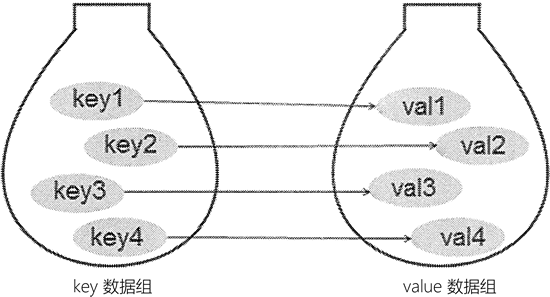

Python字典
==========

序列是一种数据结构, 其中的元素按顺序存储, 每个元素都有一个索引, 通过索引来访问元素. 
列表, 元组和字符串都属于序列.

映射是另一种数据结构, 其中的值不按顺序存储, 而是存储在键下. 
键可能是数字, 字符串或元组(不可变类型).

映射, 是数学中的术语, 简单理解, 它指的是元素之间相互的对应关系.

字典是Python中唯一的内置映射类型. 
字典中, 习惯将各元素对应的索引称为键(key), 各个键对应的元素称为值(value), 键及其关联的值称为"键值对".

总的来说, 字典类型的主要特征如下所示:

.. table:: Python字典特征

    ============================== ==================================================================
    主要特征                       解释
    通过键而不是索引来读取元素     字典类型有时也称为关联数组或者散列表(hash). 

                                   它是通过键将一系列的值联系起来的, 
                                   
                                   这样就可以通过键从字典中获取指定项, 但不能通过索引来获取.
    字典是任意数据类型的无序集合   在列表和元组中, 通常会将索引为0的元素称为第一个元素(有序的). 

                                   而字典中的元素是无序的.
    字典是可变的, 并且可以任意嵌套 字典可以在原处増长或者缩短(无需生成一个副本), 

                                   并且它支持任意深度的嵌套, 即字典存储的值也可以是列表或其它的字典.
    字典中的键必须唯一             字典中, 不支持同一个键出现多次, 否则只会保留最后一个键值对.
    字典中的键必须不可变           字典中的键是不可变的, 只能使用数字, 元组或者字符串.
    ============================== ==================================================================

创建字典
--------

*   使用\ ``{}``\ 创建字典

字典中每个元素都包含两个部分, 分别是键(key)和值(value). 
在创建字典时, 键和值之间用冒号\ ``:``\ 分隔, 相邻元素之间用逗号\ ``,``\ 分隔, 所有元素放在花括号\ ``{}``\ 中.

使用\ ``{}``\ 创建字典的语法格式如下:

.. code-block:: python

    dictName = {key1: value1, key2: value2, ..., keyN: valueN}

字典的键可以是整数, 字符串或者元组, 只要符合唯一和不变的特性就行; 字典的值可以是Python中的任意数据类型.

Example:

.. code-block:: python

    # 使用字符串作为key
    socres = {'语文': 100, '数学': 100, '英语': 99}

    # 使用元组和数字作为key
    dict1 = {(20, 30): 'great', 30: [1, 2, 3]}

    # 创建空字典
    dict2 = {}

*   通过\ ``fromkeys()``\ 方法创建字典

在Python中, 还可以使用dict字典类型提供的\ ``fromkeys()``\ 方法创建带有默认值的字典, 具体格式为:

.. code-block:: python

    dictName = dict.fromkeys(List, value=None)

其中, ``List``\ 表示字典中所有键的列表, ``value``\ 参数表示默认值, 如果省略, 则默认值为\ ``None``\ .

Example:

.. code-block:: python

    knowledge = ['语文', '数学', '英语']
    scores = dict.fromkeys(knowledge, 100)

*   通过\ ``dict()``\ 函数创建字典

通过\ ``dict()``\ 函数创建字典的写法有很多种, 这里介绍几种常用的方式:

.. table:: ``dict()``\ 函数创建字典

    +-------------------------------------------------------+------------------------------------------------------------+
    | 创建格式                                              | 说明                                                       | 
    +=======================================================+============================================================+
    | ``a = dict(str1=value1, str2=value2, ...)``           | ``str``\ 表示字符串类型的键, ``value``\ 表示键对应的值.    |
    |                                                       |                                                            |
    |                                                       | 使用此方式创建字典时, 作为字符串类型的键不能带引号.        |
    +-------------------------------------------------------+------------------------------------------------------------+
    | # 方式1                                               | 向\ ``dict()``\ 函数传入列表或元组,                        |
    |                                                       |                                                            |
    | ``demo = [('one', 1), ('two', 2), ('three', 3)]``     | 而它们的每个元素又是包含2个元素的列表或元组,               |
    |                                                       |                                                            |
    | # 方式2                                               | 其中第一个元素作为键, 第二个元素作为值.                    |
    |                                                       |                                                            |
    | ``demo = [['one', 1], ['two', 2], ['three', 3]]``     |                                                            |
    |                                                       |                                                            |
    | # 方式3                                               |                                                            |
    |                                                       |                                                            |
    | ``demo = (('one', 1), ('two', 2), ('three', 3))``     |                                                            |
    |                                                       |                                                            |
    | # 方式4                                               |                                                            |
    |                                                       |                                                            |
    | ``demo = (['one', 1], ['two', 2], ['three', 3])``     |                                                            |
    |                                                       |                                                            |
    | ``a = dict(demo)``                                    |                                                            |
    +-------------------------------------------------------+------------------------------------------------------------+
    | # 可以是列表, 元组或字符串                            |                                                            |
    |                                                       |                                                            |
    | ``keys = ['one', 'two', 'three']``                    | 通过应用\ ``dict()``\ 函数和\ ``zip()``\ 函数,             |
    |                                                       |                                                            |
    | # 可以是列表, 与元组或字符串                          | 可将两个序列转换为对应的字典.                              |
    |                                                       |                                                            |
    | ``values = [1, 2, 3]``                                |                                                            |
    |                                                       |                                                            |
    | ``a = dict(zip(keys, values))``                       |                                                            |
    +-------------------------------------------------------+------------------------------------------------------------+

如果不为\ ``dict()``\ 函数传入任何参数, 则表示创建一个空的字典.

访问字典
--------

列表和元组都是通过下标来访问元素的, 而字典不同, 它通过键来访问对应的值. 

Python中访问字典元素的具体格式为:

.. code-block:: python
    :emphasize-lines: 1

    dictName[key]

key表示键名, 注意, 键必须是存在的, 都则会引发异常.

除了上面这种方式外, Python更推荐使用dict类型提供的\ ``get()``\ 方法来获取指定键对应的值. 
当指定的键不存在时, ``get()``\ 方法不会引发异常.

``get()``\ 方法的语法格式为:

.. code-block:: python
    :emphasize-lines: 1

    dictName.get(key[, default])

``default``\ 用于指定要查询的键不存在时, 此方法返回的默认值, 如果没有指定, 则默认返回\ ``None``\ .

Example:

.. code-block:: python

    d1 = dict(a=100, b=200, c=300, d=400)
    print(d1)

    print(d1.get('a'))
    print(d1.get('x', '该键不存在'))

删除字典
--------

和删除列表, 元组一样, 手动删除字典可以使用\ ``del``\ 关键字.

需要注意删除的是一个变量, 还是字典中的一个元素. 
如果\ ``del``\ 的参数是一个变量(字典名), 表示删除的是一个变量; 如果\ ``del``\ 的参数是\ ``dictName[key]``\ 的形式, 表示删除的是字典中的一项.

Example:

.. code-block:: python

    d1 = {'a': 100, 'b': 200, 'c': 300, 'd': 400}

    # 删除字典中的一项
    del d1['a']

    # 删除变量
    del d1

