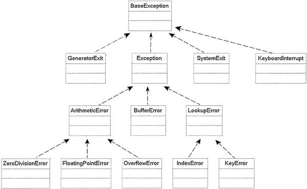

Python自定义异常类
==================

Python提供了很多内置的异常类, 涉及的范围很广, 能够满足很多需求. 
但有时候我们想自定义创建异常类,因为异常处理是基于异常所属的类型, 所以如果想对某种错误进行特殊的错误处理, 就需要有一个专门用于表示这种异常的类.

如何自定义异常类呢?
就和创建其它类一样, 但必须直接或间接地继承\ ``Exception``\ .

.. code-block:: python

    class SomeCustomeExceptionError(Exception):
        pass

*   尽量使用内置的异常类, 确有必要时, 再自定义异常类;
*   由于大多数Python内置异常的名字都以\ ``Error``\ 结尾, 自定义异常类命名时应尽量跟标准的异常命名一样;

Example:

.. code-block:: python

    class InputError(Exception):
    '''当输出有误时, 抛出此异常'''

    # 自定义异常类型初始化
    def __init__(self, value):
        self.value = value

    # 返回异常类对象的说明信息
    def __str__(self):
        return ('{} is invalid input'.format(repr(self.value)))

    try:
        raise InputError(1)
    except InputError as err:
        print('error: {}'.format(err))

``Exception``
-------------

Python提供了大量内置的异常类, 这些异常类之间有严格的继承关系, 如下图所示:

可以看到, ``BaseException``\ 是Python中所有异常类的基类, 但对于我们来说, 最主要的是\ ``Exception``\ 类, 因为程序中可能出现的各种异常, 都继承自\ ``Exception``\ . 
用户自定义的异常类, 不应该继承\ ``BaseException``\ , 而应该继承\ ``Exception``\ 类.

``except Exception``\ 和\ ``except``\ 的区别:

    *   ``except Exception``\ 表示捕获所有继承自\ ``Exception``\ 的异常;
    *   ``except``\ 表示所有异常(继承自\ ``BaseException``\ 的异常), 包括\ ``Ctrl + C``\ 或者调用\ ``sys.exit``\ 来退出程序的企图, 都会被捕获.

