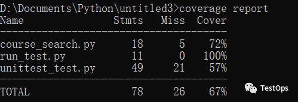
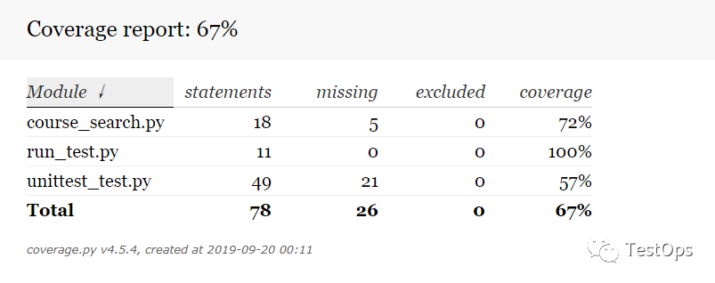
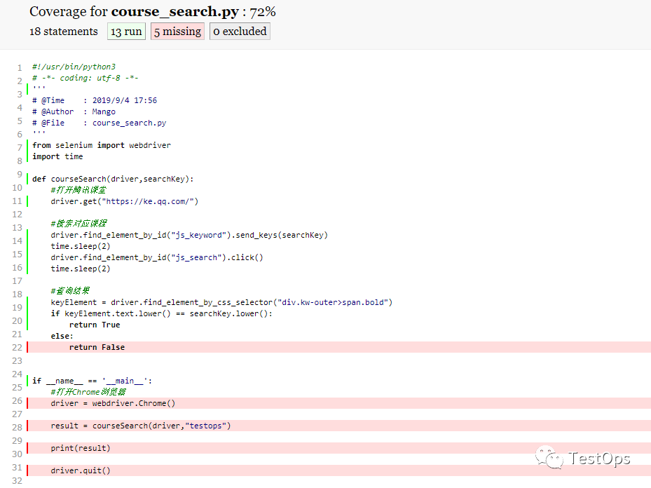

测试覆盖率
==========

**覆盖率(coverage)**\ 是一个重要的测试概念. 
运行测试时, 很可能达不到运行所有代码的理想状态(实际上, 最理想的情况是, 使用各种可能的输入检查每种可能的程序状态, 但这根本不可能做到).

.. note::

    一段代码可能包含有多行, 测试时, 可能其中有的得到执行了, 有的没有. 
    测试覆盖率, 就是得到执行的代码的比率.

你可能会觉得详尽地测试各个方面让人不堪重负. 
不用担心, 你无需测试数百种输入和状态变量组合, 至少开始的时候不用. 
在测试驱动开发的编程中, 最重要的一点是在编码期间反复地运行方法(函数或脚本), 以不断获得有关你\ **做法优劣的反馈**\ . 
如果以后要进一步确信代码是正确的(覆盖率也很高), 可以随时添加测试. 

单元测试覆盖率统计工具
----------------------

Python有自己的单元测试覆盖率统计工具, Coverage就是其中一种. 

Coverage
^^^^^^^^

Coverage是一种用于统计Python代码覆盖率的工具, 通过它可以检测测试代码对被测试代码的覆盖率如何. 
可以高亮显示代码中哪些语句未被执行, 哪些执行了. 并且, Coverage支持覆盖率统计, 可以生成HTML/XML报告.

* 安装

.. code-block:: python

    pip/pip3 install coverage

* 使用帮助

使用\ ``help``\ 命令查看帮助: ``coverage help``

* 使用

对于Coverage的使用, 比较简单, 直接用\ ``coverage run``\ 命令去执行已经写好的单元测试用例就好了.

.. code-block:: python

    coverage run test.py arg1 arg2

这里的test.py是已经完成的测试用例脚本, arg1和arg2是test.py执行所需的参数.

执行结束后, 会自动生成一个覆盖率统计结果文件, 使用\ ``coverage report``\ 来查看. 

* ``Stmts``\ : 表示语句总数
* ``Miss``\ : 未执行到的语句数
* ``Cover`` = (Stmts - Miss) / Stmts

当然, 也可以生成更加清理明了的html测试报告: ``coverage html -d report``\ , 这里的\ ``-d report``\ 用来指定html文件夹.
生成的报告直接关联代码, 高亮显示覆盖和未覆盖的代码, 支持排序.

使用浏览器打开report目录下index.html来查看报告. 

通过点击其中的各个py文件可以看到各自代码被执行的情况.

